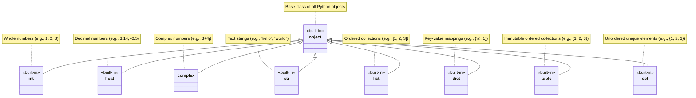
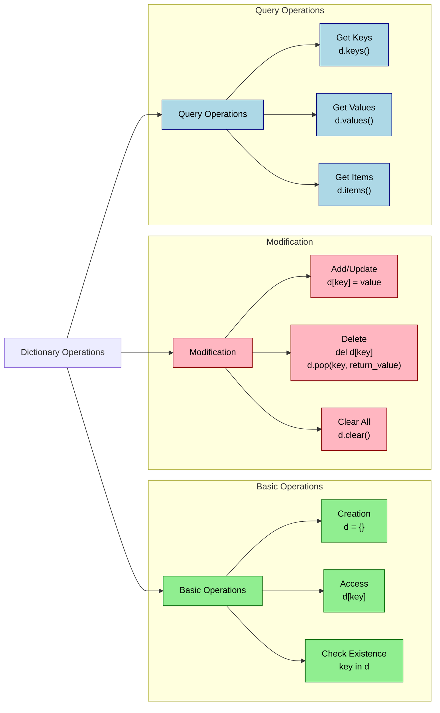
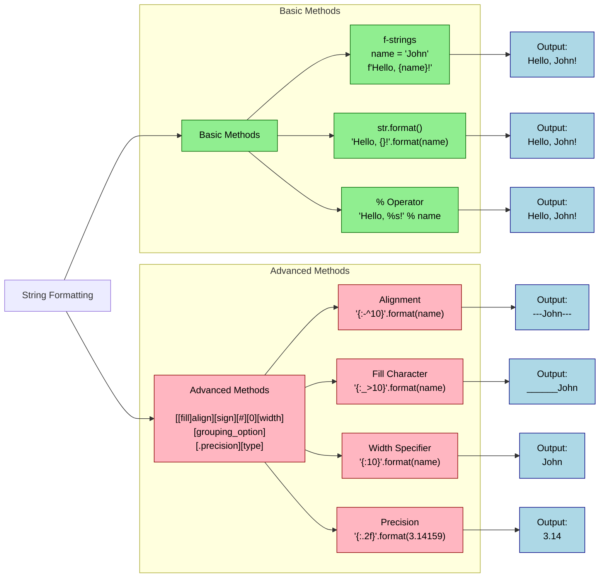
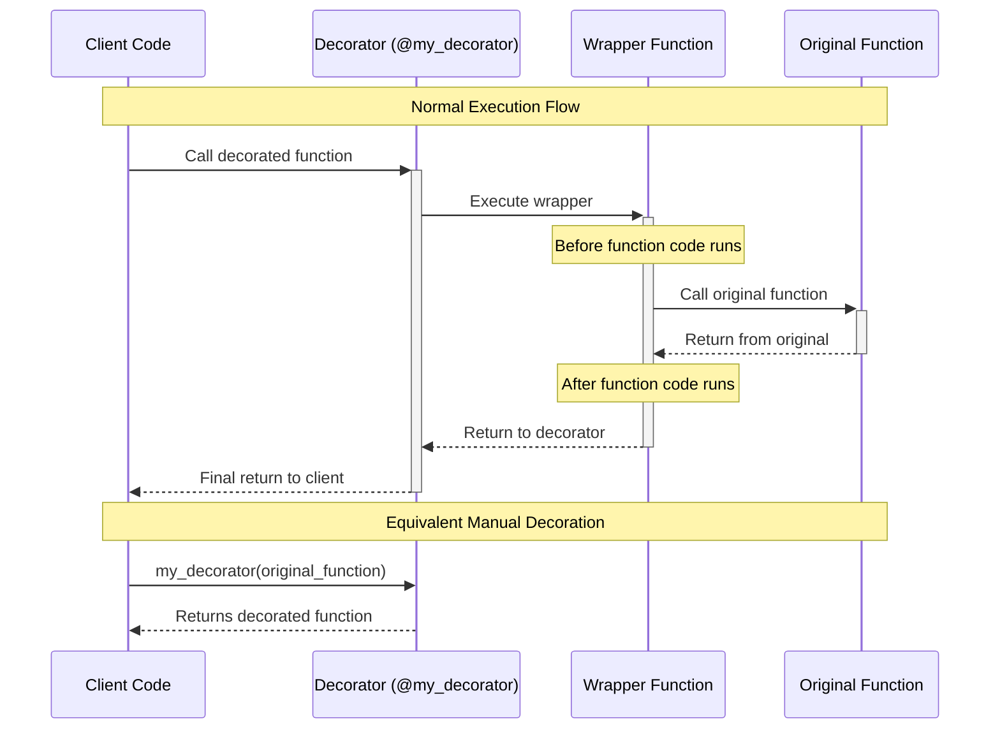
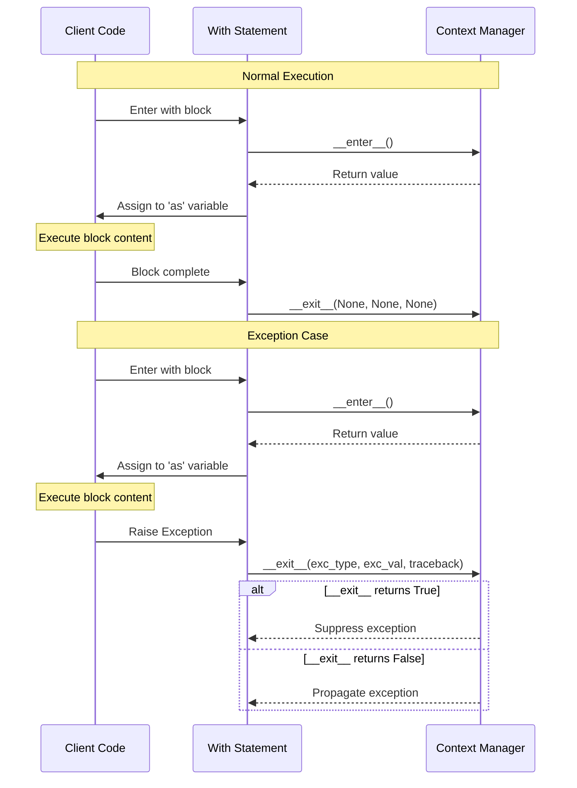
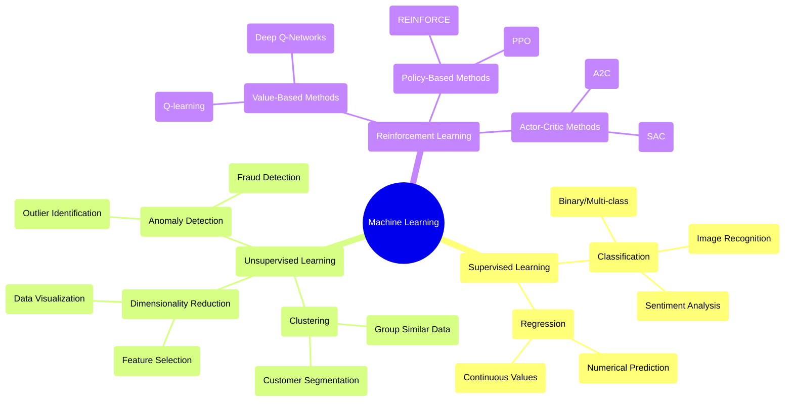
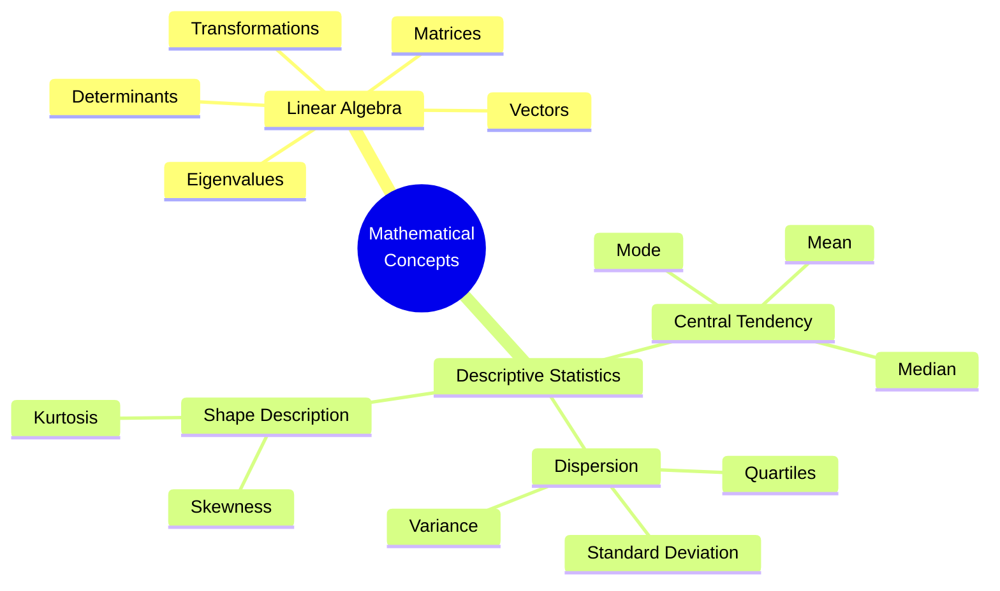

# piscine_python_ml

## Bootcamp Python

```bash
# For bootcamp python
export PYTHONPATH=/home/rcutte/Desktop/piscine_python_ml/bootcamp_python
```

### Types

<details>
<summary>More infos</summary>

- 🐍 [ Python - Built-in Types](https://docs.python.org/3/library/stdtypes.html)
  - https://docs.python.org/3/library/stdtypes.html#truth-value-testing
  - https://docs.python.org/3/library/stdtypes.html#numeric-types-int-float-complex
  - https://docs.python.org/3/library/stdtypes.html#numeric-types-int-float-complex
  - https://docs.python.org/3/library/stdtypes.html#sequence-types-list-tuple-range
  - https://docs.python.org/3/library/stdtypes.html#text-sequence-type-str
  - https://docs.python.org/3/library/stdtypes.html#set-types-set-frozenset
  - https://docs.python.org/3/library/stdtypes.html#mapping-types-dict



</details>

#### Dict

<details>
<summary>More infos</summary>

- 🐍 [ Python - Dictionaries ](https://docs.python.org/3/library/stdtypes.html#mapping-types-dict)



</details>

### Formating

<details>
<summary>More infos</summary>

- 🐍 [ Python - Format Specification Mini-Language ](https://docs.python.org/3.9/library/string.html#format-specification-mini-language)



</details>

### Vectors

[ 📹 Youtube - Vectors - Essence of linear algebra](https://youtu.be/fNk_zzaMoSs?si=nukJqaKyoSkP-tFA)
🐍 [ Python - datamodel - numeric types](https://docs.python.org/3.9/reference/datamodel.html#emulating-numeric-types)

### Builtins functions

- 🐍 [ Python - Builtin Functions](https://docs.python.org/3.9/library/functions.html)
  - https://docs.python.org/3.9/library/functions.html#vars
  - https://docs.python.org/3.9/library/functions.html#dir

### Decorators

<details>
<summary>Decorators</summary>

- 🐍 [ Python - Decorators](https://docs.python.org/3/glossary.html#term-decorator)



Best Practices

1. Always use functools.wraps to preserve the original function's metadata:

```python
from functools import wraps

def my_decorator(func):
    @wraps(func)  # Preserves function name, docstring, etc.
    def wrapper(*args, **kwargs):
        return func(*args, **kwargs)
    return wrapper
```

2. Handle arguments properly using \*args and \*\*kwargs:

```python
def flexible_decorator(func):
    def wrapper(*args, **kwargs):
        print(f"Received args: {args}, kwargs: {kwargs}")
        return func(*args, **kwargs)
    return wrapper
```

</details>

### Context Managers

<details>
<summary>More infos</summary>

- 🐍 [ Python - Context Managers](https://docs.python.org/3/library/stdtypes.html#typecontextmanager)



</details>

### Package

🐍 [Python - Creating a packgage](https://docs.python.org/3.9/distributing/index.html) - https://packaging.python.org/en/latest/tutorials/packaging-projects/#packaging-python-projects - https://docs.python.org/3/tutorial/modules.html#packages - [Setuptools - Config](https://setuptools.pypa.io/en/latest/userguide/pyproject_config.html)

```bash
# Setup the env
python3 -m venv .venv
source .venv/bin/activate
```

```bash
pip install setuptools wheel twine

# Setup your package
```

```bash
# After setting up the package - update build
python3 -m pip install --upgrade build
```

```bash
# Build the package
python3 -m build
```

📜 [Choose a license](https://choosealicense.com/)

### Numpy

- https://numpy.org/doc/2.2/
- https://numpy.org/doc/2.2/user/absolute_beginners.html
- https://numpy.org/doc/2.2/reference/index.html
- https://numpy.org/doc/2.2/user/basics.broadcasting.html#basics-broadcasting

### Matplotlib

https://matplotlib.org/stable/contents.html
https://matplotlib.org/stable/users/explain/quick_start.html

#### Plot Setup

https://matplotlib.org/stable/api/_as_gen/matplotlib.pyplot.scatter.html#matplotlib.pyplot.scatter

##### Plot Colors and markers

https://matplotlib.org/stable/api/markers_api.html#module-matplotlib.markers
https://matplotlib.org/stable/users/explain/colors/colormaps.html#sphx-glr-users-explain-colors-colormaps-py

### Pandas

- https://pandas.pydata.org/docs/getting_started/index.html#intro-to-pandas
- https://pandas.pydata.org/docs/user_guide/10min.html#min
- https://pandas.pydata.org/docs/
- https://pandas.pydata.org/docs/user_guide/index.html

## Bootcamp ML

```bash
# For importing the bootcamp_ml and bootcamp_python modules
export PYTHONPATH=/home/rcutte/Desktop/piscine_python_ml
```

## Machine Learning

- [coursera - Machine Learning](https://www.coursera.org/learn/machine-learning)
- [youtube - Machine Learning](https://youtube.com/playlist?list=PLkDaE6sCZn6FNC6YRfRQc_FbeQrF8BwGI&feature=shared)



### Types

There are 4 types of machine learning:
- Supervised Learning
- Unsupervised Learning
- Recommender Systems
- Reinforcement Learning

### Supervised Learning

"Learn from right answers"

Helps to predict the output when given an input.

| Input (X) | Output (Y) | Application Examples |
|-----------|------------|---------------------|
| House Features | Price | Real Estate Pricing |
| Email Content | Spam/Not Spam | Email Filtering |
| Medical Images | Disease/No Disease | Medical Diagnosis |
| Audio Files | Text Transcript | Speech Recognition |
| Historical Prices | Future Prices | Stock Prediction |
| Image of a product | Defects | Quality Control |


#### Regression

- Predict continuous valued output
    - Predict a number: infinite number of values
- E.g., predict house price

##### Linear Regression

- Simplest form of regression
- Assumes linear relationship between input and output
- E.g., predict house price based on size

###### Univariate Linear Regression

One feature (input variable) and one target variable (output variable).

- $f_{w,b}(x) = w x + b$
    - $w$ = slope
    - $b$ = y-intercept

###### Cost Function: Mean Squared Error (MSE)

- Measures the average of the squares of the errors or deviations
    - E.g., difference between predicted and actual value
$$
\begin{align*}
    \text{Error} & = \text{Estimate} - \text{Actual value} = \hat{y} - y \\
    \text{Total Errors} & = \sum_{i=1}^{m} (\hat{y}^{(i)} - y^{(i)})^2 \\
    \text{Mean Squared Error} & = \frac{1}{m} \sum_{i=1}^{m} (\hat{y}^{(i)} - y^{(i)})^2 \\
    \text{Cost Function} & = \frac{1}{2m} \sum_{i=1}^{m} (\hat{y}^{(i)} - y^{(i)})^2 \\
    & \text{where } \frac{1}{2} \text{ is used to simplify the derivative} \\
    & \hat{y}^{(i)} = f_{w,b}(x^{(i)}) = w x^{(i)} + b \\
    J_{w,b} & = \frac{1}{2m} \sum_{i=1}^{m} (f_{w,b}(x^{(i)}) - y^{(i)})^2 \\
\end{align*} \\
$$

- Goal: minimize the cost function
    - Find the best values for $w$ and $b$
        - Simplified : $J_{w}$ = cost function with respect to $w$
    - E.g., find the best fit line


#### Classification

- Predict discrete valued output
    - Predict categories or labels: small number of discrete values
- E.g., predict spam or not spam

### Unsupervised Learning

"Learn from unlabeled data"

Helps to find patterns in data.
    - Only input data (no output data)

| Input (X) | Application Examples |
|-----------|---------------------|
| Customer Data | Customer Segmentation |
| News Articles | Topic Modeling |
| Audio Files | Music Genre Classification |
| Image Data | Image Clustering |
| Sensor Data | Anomaly Detection |
| DNA Sequences | Gene Expression Analysis |


#### Clustering

- Group similar data points together
- E.g., customer segmentation

#### Anomaly Detection

- Identify unusual data points
- E.g., fraud detection

#### Dimensionality Reduction

- Compress data using fewer numbers, while preserving the most important information
- E.g., data visualization

### Notation

- $m$ = number of training examples
- $x$ = input variable/features
- $y$ = output variable/target
- $(x, y)$ = one training example
- $(x^{(i)}, y^{(i)})$ = $i^{th}$ training example
    - $i^{th}$ = index into training set ($i$ is an index, not an exponent) $\neq$
- $X$ = input matrix
- $Y$ = output matrix
- $f$ = target function / model
- $w, b$ = parameters / coefficients / weights
- $\hat{y}$ = predicted output / estimate for $y$

## Math



### Visualization

- [3D Geogebra](https://www.geogebra.org/3d)

### Statistics

#### Central Tendency

- Mean: https://www.mathsisfun.com/mean.html
- Median: https://www.mathsisfun.com/median.html

##### K-Means

https://neptune.ai/blog/k-means-clustering
https://www.geeksforgeeks.org/k-means-clustering-introduction/
[](https://en.wikipedia.org/wiki/K-means_clustering)

#### Dispersion

- Quartiles: https://www.mathsisfun.com/data/quartiles.html


- Standard Deviation and Variance: https://www.mathsisfun.com/data/standard-deviation.html


### Linear Algebra

#### L1 and L2

- L1 - Manhattan Distance
    - Also: Taxicab Distance
    - Measures the distance between two points as if you were traveling along a city grid and can only move along the streets (no diagonals).
    - May be preferred when dimensions are not of the same scale.
- L2 - Euclidean Distance
    - Measures the distance between two points as if you could travel through the air (no obstacles).
    - More sensitive to differences in magnitude between dimensions.

[Difference betwenn L1 and L2](https://medium.com/@datasciencejourney100_83560/difference-between-l1-manhattan-and-l2-euclidean-distance-c70b5da25fe0)


#### Vectors

[ 📹 Youtube - Vectors - Essence of linear algebra](https://youtu.be/fNk_zzaMoSs?si=nukJqaKyoSkP-tFA)

#### Matrices

[ 📹 Youtube - Matrices - Essence of linear algebra](https://youtu.be/kYB8IZa5AuE?si=3Q9Q9QJvQ7qQ7qQ7)
