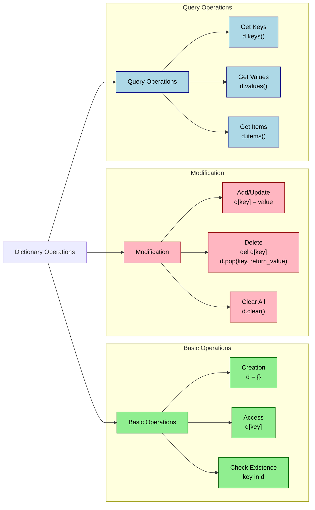
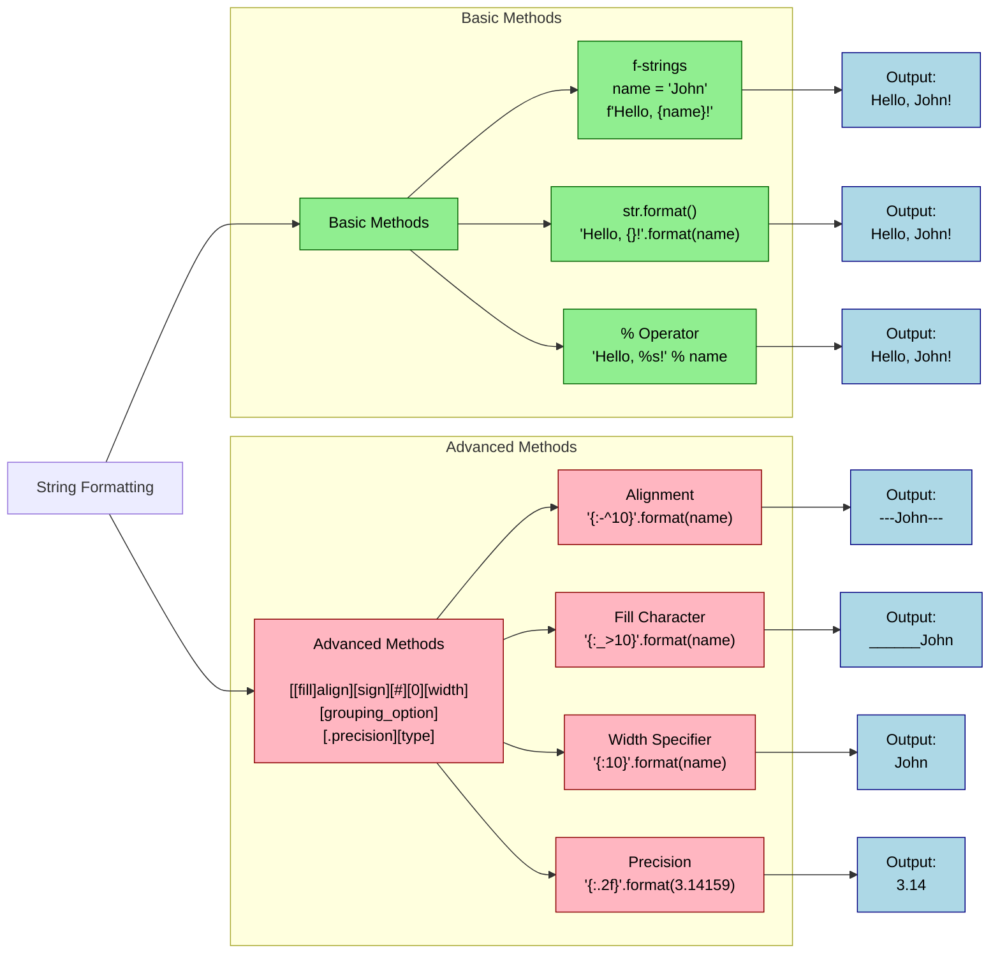

# piscine_python_ml

## Bootcamp Python

### Types

```mermaid
classDiagram
    class object {
        <<built-in>>
    }
    class int {
        <<built-in>>
    }
    class float {
        <<built-in>>
    }
    class str {
        <<built-in>>
    }
    class list {
        <<built-in>>
    }
    class dict {
        <<built-in>>
    }
    class tuple {
        <<built-in>>
    }
    class set {
        <<built-in>>
    }
    
    object <|-- int
    object <|-- float
    object <|-- complex
    object <|-- str
    object <|-- list
    object <|-- dict
    object <|-- tuple
    object <|-- set
    
    note for object "Base class of all Python objects"
    note for int "Whole numbers (e.g., 1, 2, 3)"
    note for float "Decimal numbers (e.g., 3.14, -0.5)"
    note for complex "Complex numbers (e.g., 3+4j)"
    note for str "Text strings (e.g., 'hello', \'\'world\'\')"
    note for list "Ordered collections (e.g., [1, 2, 3])"
    note for dict "Key-value mappings (e.g., {'a': 1})"
    note for tuple "Immutable ordered collections (e.g., (1, 2, 3))"
    note for set "Unordered unique elements (e.g., {1, 2, 3})"
```

#### Dict

```mermaid
flowchart LR
    classDef basic fill:#90EE90,stroke:#006400,color:#000000
    classDef modify fill:#FFB6C1,stroke:#8B0000,color:#000000
    classDef query fill:#ADD8E6,stroke:#000080,color:#000000
    
    Start["Dictionary Operations"] --> Basic["Basic Operations"]
    Start --> Modify["Modification"]
    Start --> Query["Query Operations"]
    
    subgraph "Basic Operations"
        Basic --> Create["Creation
        d = {}"]
        Basic --> Access["Access
        d[key]"]
        Basic --> Check["Check Existence
        key in d"]
    end
    
    subgraph "Modification"
        Modify --> Add["Add/Update
        d[key] = value"]
        Modify --> Delete["Delete
        del d[key]<br>d.pop(key, return_value)"]
        Modify --> Clear["Clear All
        d.clear()"]
    end
    
    subgraph "Query Operations"
        Query --> Keys["Get Keys
        d.keys()"]
        Query --> Values["Get Values
        d.values()"]
        Query --> Items["Get Items
        d.items()"]
    end
    
    class Basic,Create,Access,Check basic
    class Modify,Add,Delete,Pop,Clear modify
    class Query,Keys,Values,Items query
```

### Formating

https://docs.python.org/3.9/library/string.html#format-specification-mini-language

```mermaid
flowchart LR
    classDef basic fill:#90EE90,stroke:#006400,color:#000000
    classDef advanced fill:#FFB6C1,stroke:#8B0000,color:#000000
    classDef output fill:#ADD8E6,stroke:#000080,color:#000000
    
    Start["String Formatting"] --> Basic["Basic Methods"]
    Start --> Advanced["Advanced Methods<br><br>[[fill]align][sign][#][0][width][grouping_option][.precision][type]"]
    
    subgraph "Basic Methods"
        Basic --> F["f-strings
        name = 'John'
        f'Hello, {name}!'"]
        Basic --> Format["str.format()
        'Hello, {}!'.format(name)"]
        Basic --> Percent["% Operator
        'Hello, %s!' % name"]
    end
    
    subgraph "Advanced Methods"
        Advanced --> Align["Alignment
        '{:-^10}'.format(name)"]
        Advanced --> Fill["Fill Character
        '{:_>10}'.format(name)"]
        Advanced --> Width["Width Specifier
        '{:10}'.format(name)"]
        Advanced --> Precision["Precision
        '{:.2f}'.format(3.14159)"]
    end
    
    F --> Output1["Output:
    Hello, John!"]
    Format --> Output2["Output:
    Hello, John!"]
    Percent --> Output3["Output:
    Hello, John!"]
    Fill --> Output4["Output:<br>______John"]
    Align --> Output5["Output:<br>---John---"]
    Width --> Output6["Output:
    John"]
    Precision --> Output7["Output:
    3.14"]
    
    class Basic,Format,F,Percent basic
    class Advanced,Align,Width,Precision,Fill advanced
    class Output1,Output2,Output3,Output4,Output5,Output6,Output7 output
```
